# Instructies voor de smartfestival applicataion

De applicatie builden en deployen werd zo eenvoudig mogelijk gemaakt. Het meeste wordt gedaan door scripts maar afhankelijk van de aanwezige versies op de cluster kan dit soms een manuele aanpak nodig zijn.

Alle implementaties werden in spring boot gedaan. Volgende puntjes komen aanbod in deze readme:

- Opbouw
- De applicatie builden
- Deployen op docker
- Deployen op kubernetes
- Functionaliteiten uittesten

## Opbouw

De applicatie bezit meerdere mappen en bestanden. Een korte uitleg bij de bedoeling van deze mappen/bestanden:

- **Service mappen**: Dit zijn mappen waar de effectieve imlementatie van de service zich in bevindt.
- **ApiGateway**: Dit is de apigateway van de applicatie
- **Frontend**: Dit bevat een react frontend. In de build submap van deze map vindt je de effectie HTML bestanden die gegenereerd zijn door `yarn build production`. Zou deze worden gebruikt voor iets, vergeet zeker niet een ``npm install`of`yarn install` uit te voeren.
- **Kubernetes**: Deze map bevat kubernetes deployment bestanden, later hierover meer (Deployen op kubernetes).
- **build-all.bat/buildall.sh**: Deze 2 bestanden doen hetzelfde maar zijn een implementatie voor respectievelijk Windows en Linux/Mac. Deze scripts builden gewoonweg alle spring projecten.
- **clean_files.sh**: Kuist alle build bestanden op
- **clean.sh**: Dit script is enkel bedoelt voor de kubernetes cluster en zal de gehele cluster opkuisen.
- **kompose.sh/kompose_fix.sh**: Deze scripts dienen voor het deployen van de applicatie op kubernetes en zijn ook enkel bruikbaar op de cluster zelf. Hierover volgt later meer uitleg (Deployen op kubernetes).
- **dockerfile**: Elke service map bevat ook een docker file.
- **docker-compose.yaml**: Deze bevindt zich in de root van het project

## De applicatie builden

Zoals eerder vermeldt kunnen alle services worden gebuild door gebruik te maken van de build-all.bat of build-all.sh scriptjes. Deze loopen simpelweg over alle folders en voeren steeds het volgende commando uit:

```bash
mvnw clean package -DskipTests
```

## Deployen op docker

Deployen op docker gebeurt door het volgende commando uit te voeren:

```bash
docker-compose up -d
```

Er werd gebruik gemaakt van de volgende setttings:

- CPUs = 2
- Memory = 6144 MB
- Swap = 4096 MB

Er wordt vooral aangeraden om genoeg RAM te voorzien. Bij te weinig RAM lukt het deployen niet.

Om ervoor te zorgen dat de backend correct werkt met de frontend, is het wel nodig dat er een aanpassing wordt gedaan in het hosts file van het besturingsssyteem. Bij windows is dit te vinden onder `C:\Windows\System32\drivers\etc\hosts`. Hierbij moet het volgende worden toegevoegd:

```
127.0.0.1   apigateway
```

Normaal zou na het docker commando uit te voeren, de applicatie bereikbaar moeten zijn op `localhost:80` en zou alles ook correct moeten functioneren.

## Deployen op kubernetes

Voor het deployen op kubernetes is het hulp-programma 'kompose' gebruikt. Afhankelijk van de versie kan dit meerdere problemen veroorzaken. We bespreken kort meerdere methodes die mogelijk zijn om te kunnen deployen:

### Methode 1

We hebben al deployment bestanden toegevoegd die zouden moeten functioneren. Deze zijn te vinden onder de map `/Kubernetes`. Deze bestanden bevatten alle deployments config files die nodig zijn voor een succesvolle configuratie. Met het script `kompose.sh` kan gemakkelijk alles worden gedeployed zolang al deze config bestanden zich in dezelfde map bevinden als waar het kompose.sh script zich bevindt. Alles wordt dan automatisch op kuberentes gedeployed en gexposed.

### Methode 2

Werkt het vorige niet, dan kan deze methode worden gebruikt. Als er een versie van kompose wordt gebruikt die kleiner of gelijk is dan V1.19.0 dan zal dit niet 100% correct werken met de laatste versie van kubernetes. Om dit op te lossen moet het script `kompose_fix.sh` worden uitgevoerd. Hierbij worden alle configuratie bestanden opnieuw opgebouwd, aangepast zodat ze wel werken en vervolgens gedeployed en geexposed.

### Methode 3

Werkt de vorige methode ook niet. Dan kan deze worden gebruikt. Bij de nieuwste versie van kompose is geen bug meer aanwezig. Daardoor kan in principe gewoon het commando `kompose up` worden gebruikt om de applicatie te deployen. Die zal dan automatisch alle config files aanmaken en deployen. Echter hebben wij deze methode niet getest

Voor het deployen zelf hebben wij initieel methode 2 moeten gebruiken. De gebruikte kompose versie was toen V1.19.0. Ondertussen zou methode 3 al moeten werken omdat de bug gefixt werd bij kompose. Uiteraard zou methode 1 ook moeten werken omdat die config bestanden al in orde zijn en enkel nog moeten toegepast worden.

## Functionaliteiten uittesten

Hierbij overlopen we per business case de mogelijke functionaliteiten en waar ze te vinden zijn. Indien een pagina niet direct update is een manuele refresh soms nodig.

### Business use case 1: Ticket aankopen

Een potentiele visitor kan steeds een ticket reserveren en vervoglens aankopen. Ga naar het ticket scherm en voer het volgende uit:

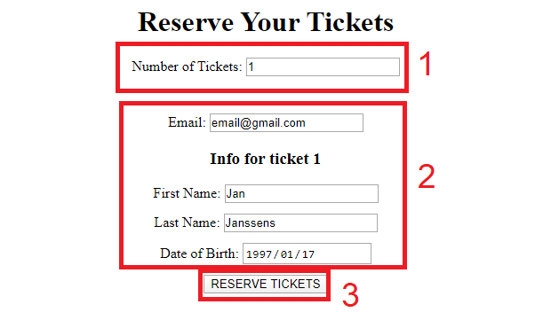

- 1: Kies het aantal tickets
- 2: Vul de informatie in
- 3: Reserveer de ticketten

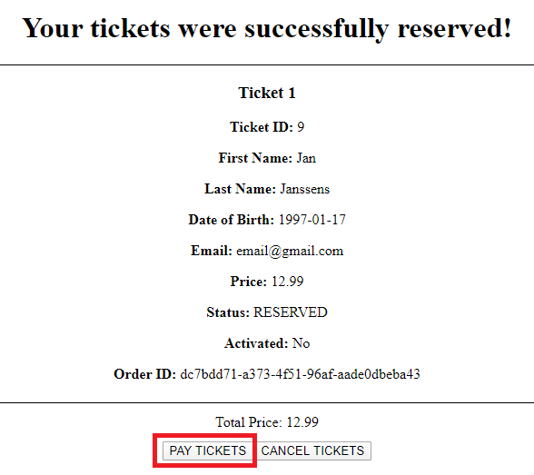

- Vervolgens kunnen de tickets met 1 druk op de knop worden aangekocht.

Er is steeds een overzicht beschikbaar van alle verkochte/geserveerde tickets aan de onderkant. Zo kan een ticket dat wel gereserveerd is maar nog niet onmiddellijk werd betaald, toch nog betaald worden:

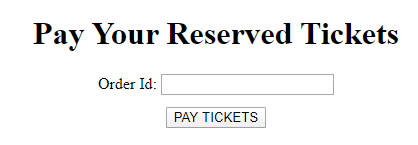

### Business use case 2: Festival toegang

Op het ticket scherm wordt onderaan steeds alle tickets getoond, inclusief hun ticket ID.

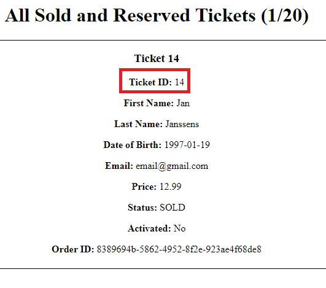

Dit ticket ID hebben we nodig om het ticket te kunnen valideren, dat te vinden is onder het visitor scherm:

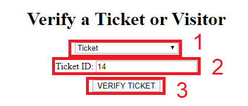

- 1: Kies ticket als soort validatie
- 2: Vul de ticket ID in
- 3: Valideer het ticket

Zou een visitor moeten worden geverifieerd bij het binnenkomen op het festival dan moet het vorige process opnieuw worden uitgevoerd, echter moet stap 1 nu als soort validatie 'visitor' krijgen. De visitor ID kan je steeds terugvinden op het visitor scherm:

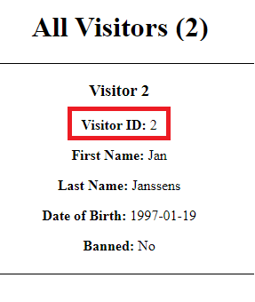

### Business use case 3: Informatie beeldschermen

Voor een bericht te sturen naar de displays, moeten we naar het notification scherm gaan en voeren we het volgend uit:

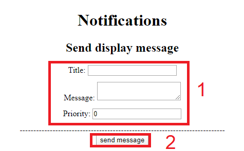

- 1: Vul de nodige informatie in
- 2: Voeg het bericht toe

Willen we tot slot deze berichten bekijken, dan gaan we naar het display scherm. Deze bevat aan de bovenkant de artiesten en aan de onderkant de berichten die worden getoond op de displays:

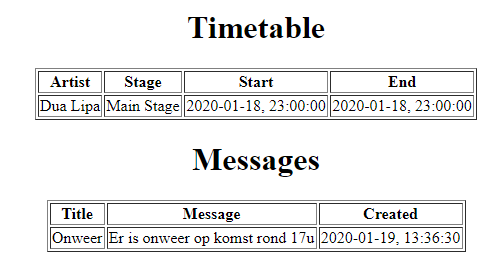

### Business use case 4: Artiesten Planning

Om een artiest toe te voegen, moeten we op het lineup scherm zijn. Hier kunnen we het volgende uitvoeren om een artiest toe te voegen:

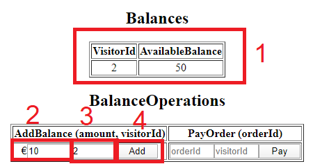

- 1: Vul de nodige informatie in
- 2: Voeg de artiest toe
- 3: Onderaan volgt een overzicht van de timetable

### Business use case 5: No Cash Festival

Een visitor heeft steeds een balans die gekoppeld is aan zijn visitor ID. Deze balans kunnen we opladen in het 'products' scherm:


- 1: Hier zien we een overzicht van alle balansen per gebruiker
- 2: Hier voeren we het bedrag in dat we wensen op te laden
- 3: Hier voeren we de visitor ID in van de visitor die zijn balans wenst op te laden
- 4: We laden de balans van een visitor op

Vervolgens kunnen we een order gaan opmaken.

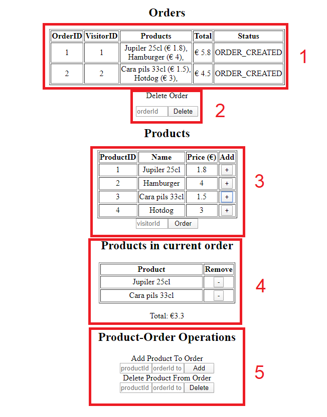

- 1: Dit is een overzicht van alle orders en bevatten een ID, de visitor die ze besteld heeft, de producten die het bevat, het totaal en de status van de order.
- 2: Hiermee kunnen order met hun order ID verwijderd worden
- 3: Hier kunnen verschillende orders worden toegevoegd, deze zijn zichtbaar in het blokje eronder (4). Als de order moet aangemaakt worden, moet de visitor ID worden ingevuld onderaan blokje 3 en vervolgens op order worden geklikt.
- 4: Hier wordt een overzicht gegeven van alle orders. Door op het minnetje te klikken kunnen ze worden verwijderd.
- 5: Dit doet hetzelfde als puntje 4 maar hierbij moet de product ID en order ID worden opgegeven. Dit is meer voor testing purposes.

Tot slot kunnen we de order betalen. Dit is via het volgende scherm door de order ID en visitor ID in te vullen. Hierbij zal het totaal worden afgetrokkken van de balans van de visitor:

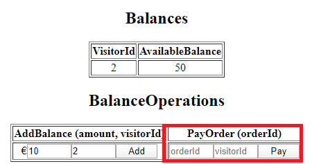

### Business use case 6: Security incident maken

Een security agent kan steeds een incident aanmaken voor een visitor:

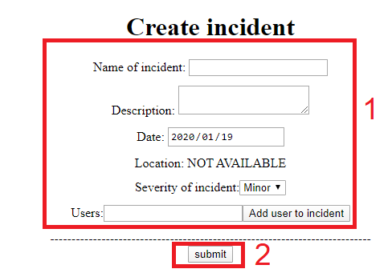

- 1: Vul de nodige informatie in. De severity bepaald of de visitor verbannen wordt van het festival of niet. Bij 2x minor of 1x major wordt de visitor verbannen. Bij de users horen steeds de user ID's van de visitors betrokken bij het incident
- 2: Dien het incident in

Op het visitor scherm kunnen we steeds nakijken of een visitor verbannen is:

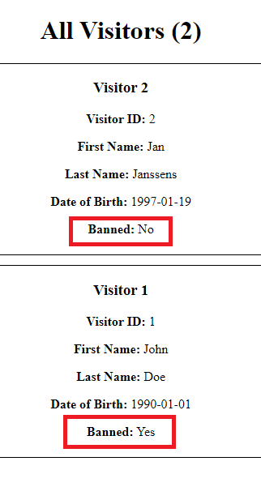

### Business use case 7: Security melding maken

Het is voor medewerkers ook steeds mogelijk om een melding bij de security te maken indien er eventuele problemen zijn. Een security agent kan hier steeds een antwoord op sturen (bv: wij zijn onderweg):

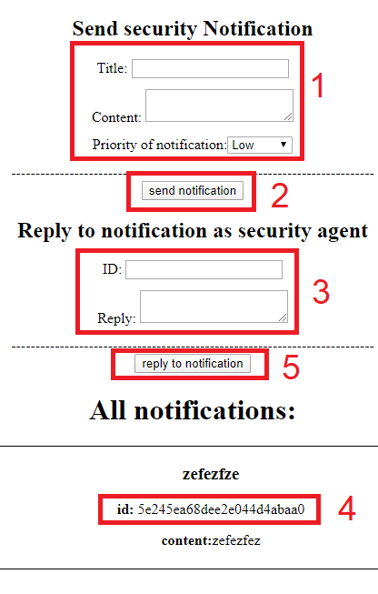

- 1: Vul de informatie in.
- 2: Verstuur de notificatie
- 3: Vul de nodige informatie in, de ID is te vinden bij bloke 4.
- 4: De ID van de melding
- 5: Verstuur de reply
# smartfestival


